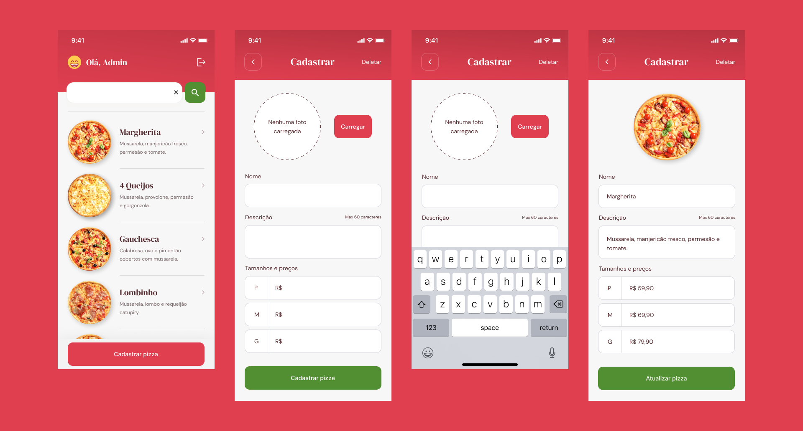
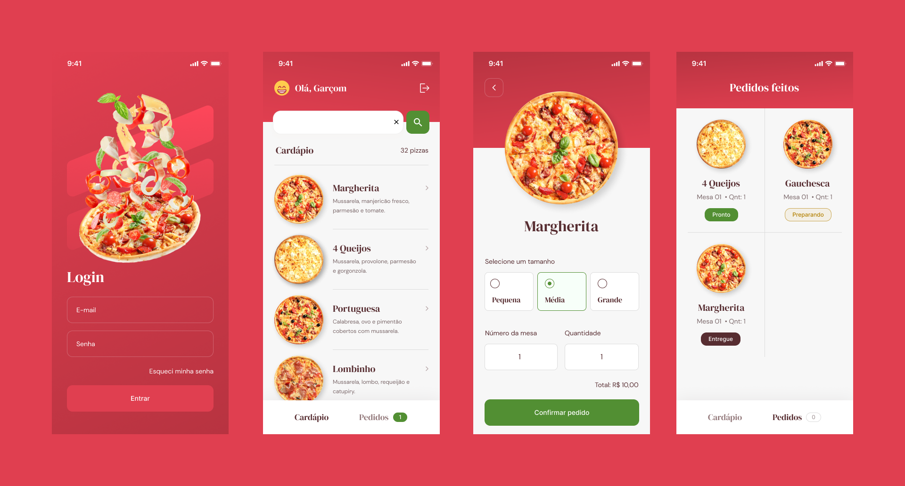
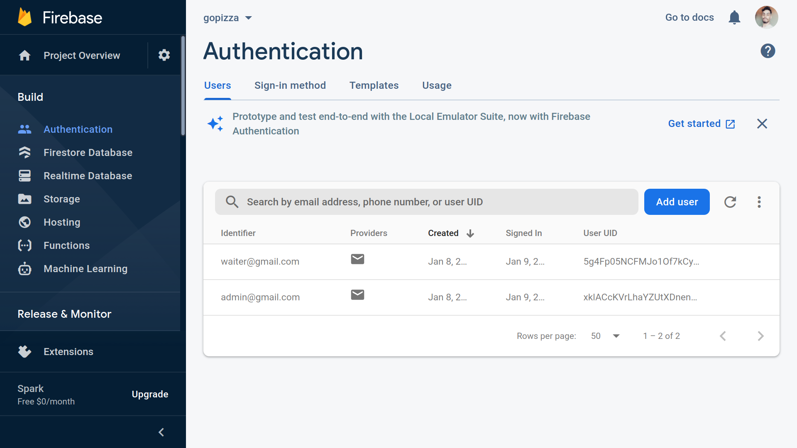
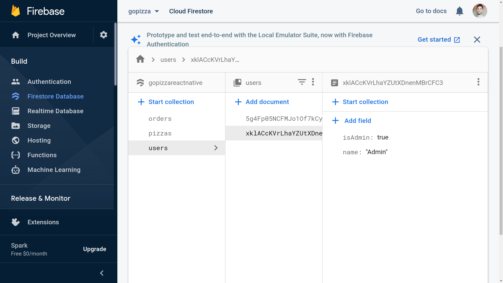
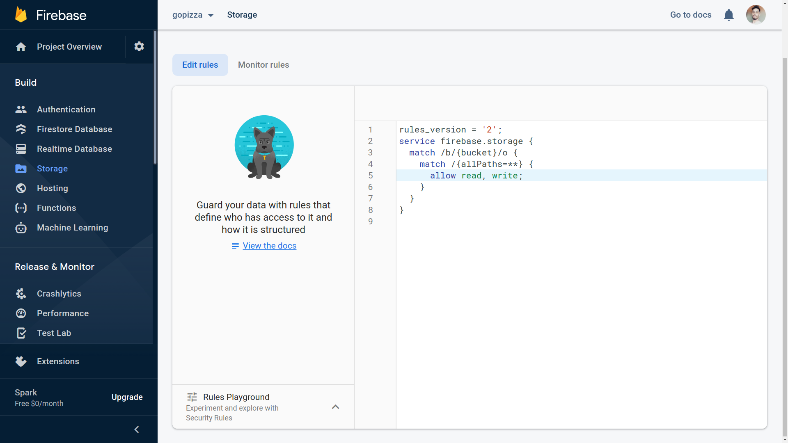

<h1 align="center">
  
</h1>

## 💻 Project

Application created with React Native to create and manage pizza parlor orders, with real-time functionality using Firebase.

### Admin screens



### Waiter screens



## :hammer_and_wrench: Features

- [x] Firebase Authentication by email and password
- [x] Firebase Authentication to reset password
- [x] Firebase Firestore to save data
- [x] Firebase Firestore to attach a listener for QuerySnapshot events
- [x] Firebase Store to save pizza image
- [x] Routing for admin and waiter users
- [x] Local data storage

## 🚀 Techs

- [x] [React Native](https://reactnative.dev)
- [x] [Expo](https://docs.expo.dev)
- [x] [TypeScript](https://www.typescriptlang.org)
- [x] [Firebase](https://firebase.google.com)

## Firebase settings

If you want to link the app to your Firebase account, follow the instructions below to make the necessary settings:

[Access documentation in Notion](https://opposite-peridot-552.notion.site/Instala-o-e-Configura-o-Firebase-bfc5dd7d1f3d4db9bf8c250ccc81c768)

You need to delete or replace in the case of Android the `google-services.json` file from the `android/app` folder.

### Firebase Authentication settings

In Firebase Authentication you need to add 2 users, if possible use valid emails, to be able to test the password reset, one user will be for the administrator profile and another for the waiter profile.

Just select the Authentication service and click `Add user`.



### Firebase Firestore settings

You now need to create a collection with the name `users` and add `2 documents` to this collection, one for the `admin` and one for the `waiter` with the following structure.

- **Document ID** = User id, obtained there from the Authentication service
- **isAdmin** = Type boolean, set true for admin and false for waiter
- **name** = Type string, is the username

The other collections are created automatically.



### Firebase Storage settings

Finally, you need to edit a Firebase Storage rule, looking like the image below.

After editing just click Publish.



```diff
rules_version = '2';
service firebase.storage {
  match /b/{bucket}/o {
    match /{allPaths=**} {
+     allow read, write;
    }
  }
}
```

## 💻 Run project

The app execution must be done with the commands listed below, and not with expo start, because of native modifications that had to be done.

```bash
# Open terminal and clone this repository
$ git clone https://github.com/Sup3r-Us3r/gopizza.git

# Install dependencies for the app
$ cd gopizza
$ npm install
# or
$ yarn install

# Start the application
$ npx react-native start
$ npx react-native run-android
```
